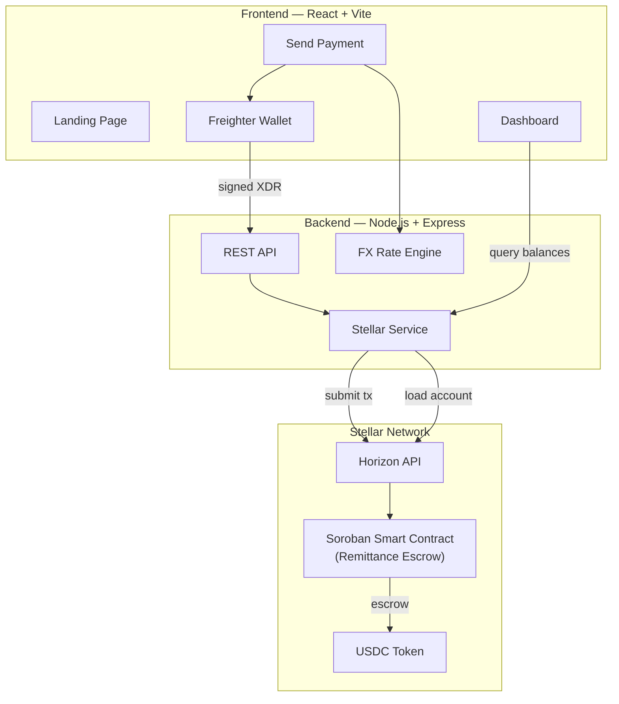

# ★ Student Remittance Hub — EduPay

<div align="center">

**Cross-border university tuition payments powered by the Stellar blockchain.**

Pay fees in your local currency → auto-converted to USDC → settled on Stellar in ~3 seconds.

[](https://stellar.org/)
[](https://react.dev/)
[](https://nodejs.org/)
[](https://vitejs.dev/)
[](https://opensource.org/licenses/MIT)

</div>

---

## Problem

International students face **high fees (3–5%)**, **slow settlement (3–7 days)**, and **opaque exchange rates** when paying tuition abroad through traditional banks and wire transfers.

## Solution

**EduPay** uses the **Stellar network** and **USDC stablecoins** to provide:

- **Instant settlement** — transactions confirm in ~3 seconds
- **Near-zero fees** — Stellar network fee is 0.00001 XLM
- **On-chain escrow** — a Soroban smart contract holds funds until the university confirms receipt
- **Transparent rates** — real-time exchange rates shown before sending
- **Self-custody** — students sign with their own Freighter wallet

---

## Architecture



---

## Features

| Feature | Description |
|---|---|
| **Soroban Escrow Contract** | USDC held on-chain until university confirms receipt |
| **Freighter Wallet** | Students sign transactions from their own custody |
| **Multi-Step Payment Flow** | Select university → enter amount → review → sign |
| **Real-Time FX Rates** | Live INR-to-USDC conversion shown before sending |
| **Dashboard** | Wallet balance, payment history, and status tracking |
| **Stellar SDK Integration** | Account lookup, tx submission, and network info via backend |
| **Responsive Design** | Glassmorphism UI with dark mode, works on all devices |
| **Platform Fees** | Configurable basis-point fees collected by the escrow contract |
| **Admin Refunds** | Contract admin can refund timed-out or disputed remittances |

---

## Tech Stack

| Layer | Technology |
|---|---|
| Frontend | React 19, Vite 8, Tailwind CSS 4, Framer Motion |
| Backend | Node.js 18+, Express 5, @stellar/stellar-sdk |
| Smart Contract | Rust, Soroban SDK 21, compiled to WASM |
| Wallet | Freighter Browser Extension |
| Stablecoin | USDC on Stellar (Circle) |
| Network | Stellar Testnet (configurable to Mainnet) |

---

## Project Structure

```
Student-Remittance-Hub/
├── frontend/                    # React + Vite SPA
│   ├── src/
│   │   ├── components/
│   │   │   └── Navbar.jsx       # Navigation with mobile responsive menu
│   │   ├── pages/
│   │   │   ├── LandingPage.jsx  # Hero + features showcase
│   │   │   ├── Dashboard.jsx    # Wallet balance, tx history, wallet connect
│   │   │   ├── SendPayment.jsx  # 3-step payment flow with Freighter signing
│   │   │   ├── Login.jsx        # Sign in page
│   │   │   └── Signup.jsx       # Registration + Freighter connect
│   │   ├── App.jsx              # Router setup
│   │   ├── main.jsx             # Entry point
│   │   └── index.css            # Design tokens + glassmorphism
│   ├── index.html
│   ├── vite.config.js
│   └── package.json
│
├── backend/                     # Express API server
│   ├── server.js                # REST API + Stellar SDK integration
│   ├── .env.example             # Environment variable reference
│   └── package.json
│
├── smart-contract/              # Soroban smart contract (Rust)
│   ├── Cargo.toml               # Workspace manifest
│   ├── README.md                # Build & deploy instructions
│   └── contracts/
│       └── remittance/
│           ├── Cargo.toml       # Crate manifest
│           └── src/
│               └── lib.rs       # Escrow contract: create, confirm, refund
│
├── package.json                 # Root scripts (concurrent dev)
├── .gitignore
└── README.md                    # ← You are here
```

---

## Quick Start

### Prerequisites

- **Node.js** ≥ 18 — [Download](https://nodejs.org/)
- **Freighter Wallet** — [Install Extension](https://www.freighter.app/)
- **Rust + Soroban CLI** *(only for smart contract development)*

### 1. Clone & Install

```bash
git clone https://github.com/your-username/Student-Remittance-Hub.git
cd Student-Remittance-Hub

# Install all dependencies (frontend + backend)
npm run install:all
```

### 2. Configure Environment

```bash
cp backend/.env.example backend/.env
# Edit backend/.env if needed (defaults work for testnet)
```

### 3. Run Development Servers

```bash
# Starts both frontend (Vite) and backend (Express) concurrently
npm run dev
```

| Service | URL |
|---|---|
| Frontend | `http://localhost:5173` |
| Backend API | `http://localhost:5000` |

### 4. Fund a Testnet Wallet

Go to [Stellar Laboratory](https://laboratory.stellar.org/#account-creator?network=test)
and create + fund a test account with Friendbot.

---

## Smart Contract

The Soroban escrow contract lives in `smart-contract/`. See
[smart-contract/README.md](./smart-contract/README.md) for full build and deployment
instructions.

### Key Functions

| Function | Who | What |
|---|---|---|
| `initialize` | Admin | Set USDC token, fee %, fee receiver |
| `create_remittance` | Student | Deposit USDC into escrow |
| `confirm_receipt` | University | Release funds to university |
| `refund` | Admin | Return funds to student |
| `get_remittance` | Anyone | Query remittance by ID |
| `set_fee_bps` | Admin | Update platform fee |

---

## API Endpoints

### Universities
| Method | Path | Description |
|---|---|---|
| `GET` | `/api/universities` | List supported universities |

### Transactions
| Method | Path | Description |
|---|---|---|
| `GET` | `/api/transactions` | List all transactions |
| `POST` | `/api/transactions` | Create a new transaction record |

### FX Rates
| Method | Path | Description |
|---|---|---|
| `GET` | `/api/fx-rates` | Get INR → USDC exchange rate |

### Stellar
| Method | Path | Description |
|---|---|---|
| `GET` | `/api/stellar/account/:address` | Query Stellar account balances |
| `POST` | `/api/stellar/submit-tx` | Submit a signed Stellar transaction (XDR) |
| `GET` | `/api/stellar/network` | Get current network info |
| `GET` | `/api/health` | Service health check |

---

## How It Works

```
┌──────────┐     ┌──────────┐     ┌──────────────────┐     ┌─────────────┐
│  Student  │────▶│  EduPay  │────▶│  Stellar Network │────▶│ University  │
│  (INR)    │     │  (USDC)  │     │  (Soroban Escrow)│     │  (receives  │
│           │     │          │     │                  │     │   USDC)     │
└──────────┘     └──────────┘     └──────────────────┘     └─────────────┘
     │                │                    │                       │
     │  1. Enter      │  2. Convert to     │  3. Escrow USDC      │
     │  amount in     │  USDC at live      │  in smart contract   │
     │  local INR     │  exchange rate     │                      │
     │                │                    │  4. University        │
     │                │                    │  confirms receipt     │
     │                │                    │  → funds released     │
```

---

## Development

### Frontend Only
```bash
cd frontend && npm run dev
```

### Backend Only
```bash
cd backend && node server.js
```

### Smart Contract
```bash
cd smart-contract
soroban contract build
cargo test
```

---

## License

MIT